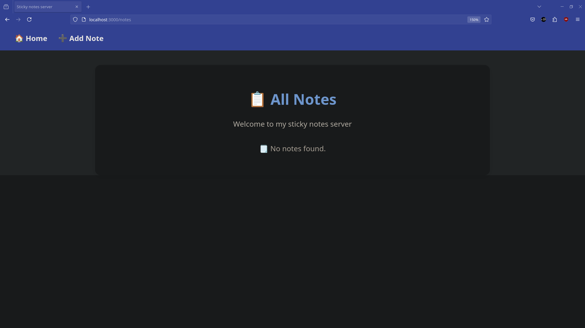
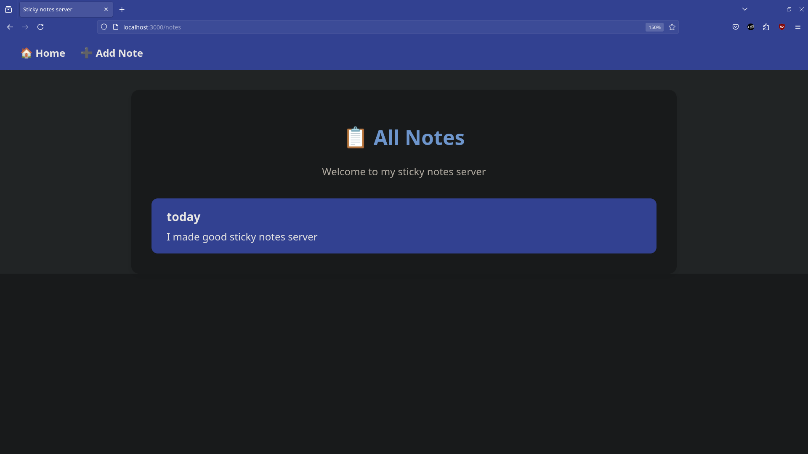

# 📒 Sticky Notes (TypeScript + Express + MongoDB)

A minimal sticky notes web app built with TypeScript, Express, MongoDB, and EJS templates.

---

## 🛠️ Features

* 📝 Create and view notes
* 🎨 Clean responsive UI with EJS views
* ⚙️ Type-safe backend using TypeScript
* 📔 MongoDB for data storage

---

## 📆 Tech Stack

* [Node.js](https://nodejs.org/)
* [Express](https://expressjs.com/)
* [MongoDB](https://www.mongodb.com/)
* [TypeScript](https://www.typescriptlang.org/)
* [EJS](https://ejs.co/)

---

## 🚀 Getting Started

1. **Clone the repo:**

   ```bash
   git clone https://github.com/Amir-Shaban32/Sticky_notes_TS.git   
   cd sticky-notes-ts
   ```

2. **Install dependencies:**

   ```bash
   npm install
   ```

3. **Start MongoDB locally**
   (Make sure it's running on `mongodb://localhost:27017/notes`)

4. **Run the app in dev mode:**

   ```bash
   npm run dev
   ```

5. **Build and run production:**

   ```bash
   npm run build
   npm start
   ```

---

## 📁 Project Structure

```
├── src/
│   ├── controllers/     # Route handlers
│   ├── models/          # MongoDB connection logic
│   ├── routes/          # Express routers
│   ├── views/           # EJS templates
│   └── server.ts        # Main server file
├── dist/                # Compiled JS output
├── .gitignore
├── package.json
├── tsconfig.json
└── README.md
```

---

## 📷 Screenshots



